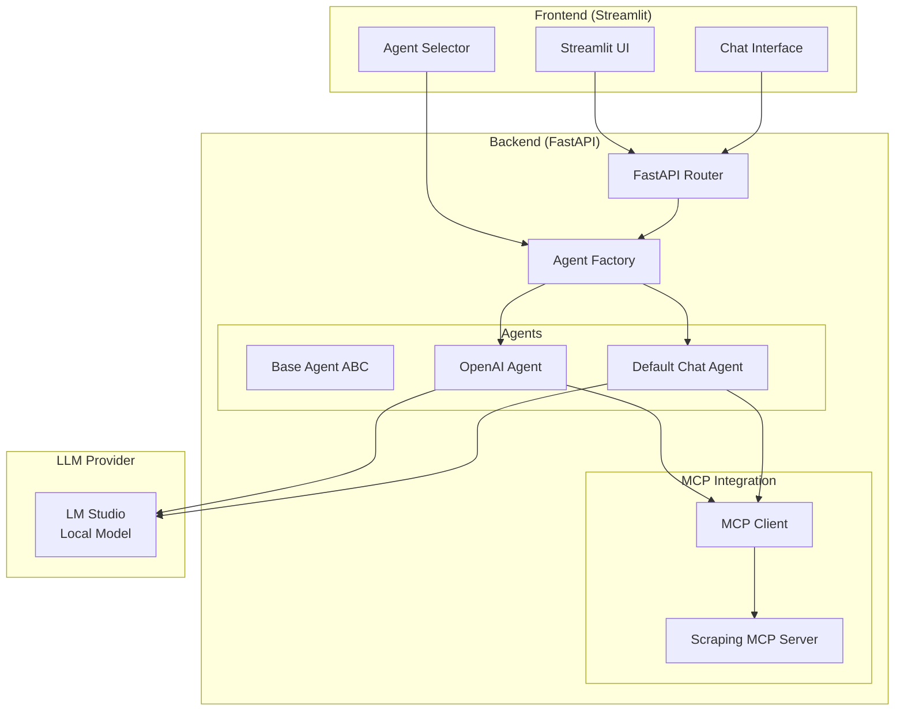
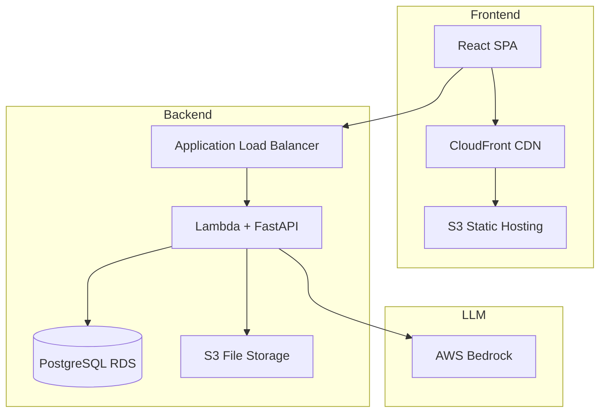

# 4. システムアーキテクチャ

システム全体の構造とコンポーネント間の関係を説明します。

## MVP アーキテクチャ

### コンポーネント構成

### レイヤー構成

**プレゼンテーション層**

- Streamlit UI
- エージェント選択UI
- チャットインターフェース

**API層**

- FastAPI Router
- エンドポイント定義
- SSEストリーミング

**ビジネスロジック層**

- Agent Factory
- Agent実装クラス
- セッション管理

**統合層**

- MCP Client
- LM Studio Client

**外部サービス層**

- LM Studio
- MCP Server

### データフロー

**ユーザーからのメッセージ送信**

1. ユーザーがStreamlitでメッセージ入力
2. API Clientが `/api/chat/stream` にPOST
3. FastAPI RouterがAgent Factoryにエージェント要求
4. Agentがメッセージを処理
5. LM Studioにリクエスト
6. ストリーミングレスポンスをSSEで返却
7. Streamlitが逐次表示

**MCPツール実行**

1. AgentがLLMレスポンスからツール呼び出し検出
2. MCP Clientがツール実行
3. MCP ServerがWebスクレイピング実施
4. 結果をLLMに返却
5. LLMが最終回答生成
6. ストリーミングでユーザーに返却

---

## Phase 2 アーキテクチャ

### コンポーネント構成

### 主な変更点

**フロントエンド**

- Streamlit → React
- ローカル → S3 + CloudFront

**バックエンド**

- ローカルFastAPI → Lambda
- メモリ管理 → PostgreSQL RDS

**LLM**

- LM Studio → AWS Bedrock

**ストレージ**

- なし → S3

---

## 設計原則

### 1. Adapterパターン

**目的**

- 複数のLLM SDKを統一インターフェースで扱う

**メリット**

- フロントエンドは単一API仕様のみ知ればよい
- 新しいSDK追加時もフロント変更不要
- バックエンドで実装を柔軟に切り替え可能

**実装**

- BaseAgent 抽象クラス
- 具体エージェントクラスが継承
- Agent Factoryでインスタンス管理

### 2. ストリーミングファースト

**目的**

- ユーザー体験の向上

**実装**

- Server-Sent Events (SSE)
- AsyncGeneratorによる非同期処理
- チャンク単位の逐次送信

### 3. セッション管理

**MVP**

- インメモリ(辞書)
- UUIDでセッション識別
- 再起動で消失(許容)

**Phase 2**

- PostgreSQLに永続化
- セッションテーブル + メッセージテーブル

### 4. MCP統合

**設計**

- MCP Clientが複数サーバーを管理
- servers.jsonで設定管理
- ツール一覧を動的に取得

**拡張性**

- 新しいMCP Serverをservers.jsonに追加するだけ
- コード変更不要

---

## セキュリティ考慮

### MVP

**ローカル環境**

- CORS設定 (ローカルホストのみ)
- 認証なし

### Phase 2以降

**追加対応**

- HTTPS通信
- APIレート制限
- 入力バリデーション

### Phase 3以降

**本格対応**

- JWT認証
- ユーザー権限管理
- セッションタイムアウト

---

## スケーラビリティ

### MVP

**制限**

- 単一ユーザー想定
- ローカル環境のみ

### Phase 2

**改善**

- Lambda自動スケーリング
- RDSスケールアップ可能
- CloudFront CDN

**目標**

- 100同時接続まで対応