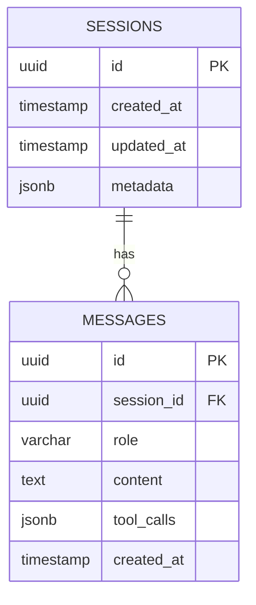

# 9. データモデル

セッションとメッセージのデータ構造を定義します。

## MVP: インメモリ管理

### Sessionクラス

**フィールド**

- `session_id`: str (UUID v4)
- `messages`: List[Dict]
- `current_agent_id`: str
- `created_at`: datetime

**メソッド**

1. **add_message(role, content)**
    - メッセージを履歴に追加
2. **get_history()**
    - 会話履歴を取得
3. **clear_history()**
    - 履歴をクリア

### Message構造

```python
{
    "role": "user" | "assistant",
    "content": str,
    "timestamp": str  # ISO 8601
}
```

### グローバルストア

```python
sessions: Dict[str, Session] = {}
```

**特徴**

- Python辞書で管理
- サーバー再起動で消失
- MVPでは許容

---

## Phase 2: PostgreSQLスキーマ

### ER図



### テーブル定義

### sessionsテーブル

```sql
CREATE TABLE sessions (
    id UUID PRIMARY KEY DEFAULT gen_random_uuid(),
    created_at TIMESTAMP DEFAULT CURRENT_TIMESTAMP,
    updated_at TIMESTAMP DEFAULT CURRENT_TIMESTAMP,
    metadata JSONB
);

CREATE INDEX idx_sessions_created_at ON sessions(created_at DESC);
```

**フィールド説明**

- `id`: セッションID (UUID)
- `created_at`: 作成日時
- `updated_at`: 更新日時
- `metadata`: エージェント情報等 (JSON)

**metadata例**

```json
{
  "agent_id": "web-scraper",
  "user_id": "user-123",
  "title": "会話タイトル"
}
```

### messagesテーブル

```sql
CREATE TABLE messages (
    id UUID PRIMARY KEY DEFAULT gen_random_uuid(),
    session_id UUID REFERENCES sessions(id) ON DELETE CASCADE,
    role VARCHAR(20) NOT NULL,
    content TEXT NOT NULL,
    tool_calls JSONB,
    created_at TIMESTAMP DEFAULT CURRENT_TIMESTAMP
);

CREATE INDEX idx_messages_session_id ON messages(session_id);
CREATE INDEX idx_messages_created_at ON messages(created_at DESC);
```

**フィールド説明**

- `id`: メッセージID (UUID)
- `session_id`: 所属セッションID (FK)
- `role`: メッセージの役割 ('user' or 'assistant')
- `content`: メッセージ本文
- `tool_calls`: ツール実行情報 (JSON)
- `created_at`: 作成日時

**tool_calls例**

```json
{
  "tool": "web_scraper",
  "arguments": {"url": "[https://example.com](https://example.com)"},
  "result": "タイトル: Example"
}
```

---

## Phase 3: ユーザー管理

### usersテーブル

```sql
CREATE TABLE users (
    id UUID PRIMARY KEY DEFAULT gen_random_uuid(),
    email VARCHAR(255) UNIQUE NOT NULL,
    name VARCHAR(100),
    created_at TIMESTAMP DEFAULT CURRENT_TIMESTAMP,
    last_login TIMESTAMP
);

CREATE INDEX idx_users_email ON users(email);
```

### sessionsテーブルに追加

```sql
ALTER TABLE sessions
ADD COLUMN user_id UUID REFERENCES users(id) ON DELETE CASCADE;

CREATE INDEX idx_sessions_user_id ON sessions(user_id);
```

---

## SQLAlchemyモデル (Phase 2)

### Sessionモデル

**フィールド**

- id: UUID (Primary Key)
- created_at: DateTime
- updated_at: DateTime
- metadata: JSON

**リレーション**

- messages: relationship("Message")

### Messageモデル

**フィールド**

- id: UUID (Primary Key)
- session_id: UUID (Foreign Key)
- role: String
- content: Text
- tool_calls: JSON
- created_at: DateTime

**リレーション**

- session: relationship("Session")

---

## クエリ例

### セッション一覧取得

```sql
SELECT 
    [s.id](http://s.id),
    s.created_at,
    s.updated_at,
    COUNT([m.id](http://m.id)) as message_count
FROM sessions s
LEFT JOIN messages m ON [s.id](http://s.id) = m.session_id
GROUP BY [s.id](http://s.id)
ORDER BY s.updated_at DESC
LIMIT 10;
```

### セッション詳細取得

```sql
SELECT 
    [m.id](http://m.id),
    m.role,
    m.content,
    m.tool_calls,
    m.created_at
FROM messages m
WHERE m.session_id = ?
ORDER BY m.created_at ASC;
```

### 最近の会話取得

```sql
SELECT * FROM sessions
WHERE updated_at > NOW() - INTERVAL '7 days'
ORDER BY updated_at DESC;
```

---

## マイグレーション (Alembic)

### 初期セットアップ

```bash
alembic init alembic
```

### マイグレーション作成

```bash
alembic revision -m "create sessions and messages tables"
```

### マイグレーション適用

```bash
alembic upgrade head
```

---

## バックアップ戦略 (Phase 2)

### 自動バックアップ

- RDS自動バックアップ有効化
- 保持期間: 7日
- スナップショット: 毎日

### 手動バックアップ

```bash
pg_dump -h <host> -U <user> -d <database> > backup.sql
```

### リストア

```bash
psql -h <host> -U <user> -d <database> < backup.sql
```